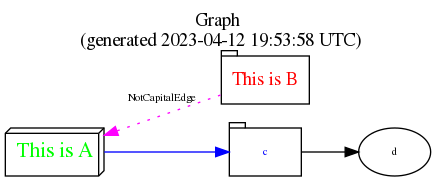

# Ruby Graph Library (RGL)
[](https://github.com/monora/rgl/actions/workflows/test.yml) [](https://github.com/monora/rgl/actions/workflows/doc.yml)
[](https://badge.fury.io/rb/rgl)
[](https://gitpod.io/#https://github.com/monora/rgl)
[](https://codeclimate.com/github/monora/rgl)

RGL is a framework for graph data structures and algorithms.

The design of the library is much influenced by the Boost Graph Library (BGL)
which is written in C++. Refer to https://www.boost.org/libs/graph/doc for
further links and documentation on graph data structures and algorithms and
the design rationales of BGL.

A comprehensive summary of graph terminology can be found in the graph section
of the *Dictionary of Algorithms and Data Structures* at
https://www.nist.gov/dads/HTML/graph.html or
[Wikipedia](https://en.wikipedia.org/wiki/Graph_%28discrete_mathematics%29).

* [GitHub Repository](https://github.com/monora/rgl)
* [API Reference](https://monora.github.io/rgl/) generated from master branch
* [API Reference](https://www.rubydoc.info/github/monora/rgl) at
    https://rubydoc.info for the latest release

## Design principles

This document concentrates on the special issues of the implementation in
Ruby. The main design goals directly taken from the BGL design are:

*   An interface for how the structure of a graph can be accessed using a
    generic interface that hides the details of the graph data structure
    implementation. This interface is defined by the module {RGL::Graph},
    which should be included in concrete classes.

*   A standardized generic interface for traversing graphs
    {RGL::GraphIterator}

RGL provides some general purpose graph classes that conform to this
interface, but they are not meant to be the **only** graph classes. As in BGL
I believe that the main contribution of the RGL is the formulation of this
interface.

The BGL graph interface and graph components are generic in the sense of the
C++ Standard Template Library (STL). In Ruby other techniques are available to
express the generic character of the algorithms and data structures mainly
using mixins and iterators. The BGL documentation mentions three means to
achieve genericity:

*   Algorithm/Data-Structure Interoperability
*   Extension through Function Objects and Visitors
*   Element Type Parameterization
*   Vertex and Edge Property Multi-Parameterization

The first is easily achieved in RGL using mixins, which of course is not as
efficient than C++ templates (but much more readable :-). The second one is
even more easily implemented using standard iterators with blocks or using the
[stream](https://www.rubydoc.info/github/monora/stream) module. The third one
is no issue since Ruby is dynamically typed: Each object can be a graph
vertex. There is no need for a vertex (or even edge type). In the current
version of RGL properties of vertices are simply attached using hashes. At
first there seems to be not much need for the graph property machinery.

### Algorithms

RGL current contains a core set of algorithm patterns:

*   Breadth First Search {RGL::BFSIterator}
*   Depth First Search {RGL::DFSIterator}

The algorithm patterns by themselves do not compute any meaningful quantities
over graphs, they are merely building blocks for constructing graph
algorithms. The graph algorithms in RGL currently include:

*   Topological Sort {RGL::TopsortIterator}
*   Connected Components {RGL::Graph#each_connected_component}
*   Strongly Connected Components {RGL::Graph#strongly_connected_components}
*   Transitive Closure {RGL::Graph#transitive_closure}
*   Dijkstras Shortest Path Algorithm {RGL::DijkstraAlgorithm}
*   Bellman Ford Algorithm {RGL::BellmanFordAlgorithm}

### Data Structures

RGL currently provides two graph classes that implement a generalized
adjacency list and an edge list adaptor.

*   {RGL::AdjacencyGraph}
*   {RGL::ImplicitGraph}

The AdjacencyGraph class is the general purpose _swiss army knife_ of graph
classes. It is highly parameterized so that it can be optimized for different
situations: the graph is directed or undirected, allow or disallow parallel
edges, efficient access to just the out-edges, fast vertex insertion and
removal at the cost of extra space overhead, etc.

### Differences to BGL

The concepts of IncidenceGraph, AdjacencyGraph and VertexListGraph
(see [IncidenceGraph](https://www.boost.org/libs/graph/doc/IncidenceGraph.html)) are
bundled in RGL's base graph module. Most methods of IncidenceGraph
should be standard in the base module Graph. The complexity guarantees
can not necessarily provided (see [BGL's Graph Concepts](https://www.boost.org/libs/graph/doc/graph_concepts.html)).

## Installation

    % gem install rgl

or download the latest sources from the [git
repository](https://github.com/monora/rgl).

If you are going to use the drawing functionalities install [Graphviz](https://www.graphviz.org/).

## Running tests

Checkout RGL git repository and go to the project directory. First, install
RGL dependencies with bundler:

    % bundle install

After that you can run the tests:

    % rake test

## Example irb session with RGL

    % irb -Ilib

    irb> require 'rgl/adjacency'
    irb> dg=RGL::DirectedAdjacencyGraph[1,2 ,2,3 ,2,4, 4,5, 6,4, 1,6]
    # Use DOT to visualize this graph:
    irb> require 'rgl/dot'
    irb> dg.write_to_graphic_file('jpg')
    "graph.jpg"

The result:


You can control the graph layout by passing layout parameters to `write_to_graphic_file`. See
`TestDot::test_to_dot_digraph_with_options` for an example using a feature implemented by Lia
Skalkos (see [PR #41](https://github.com/monora/rgl/pull/41)).

    irb> dg.directed?
    true
    irb> dg.vertices
    [5, 6, 1, 2, 3, 4]
    irb> dg.has_vertex? 4
    true

Every object could be a vertex (there is no class Vertex), even the class
object *Object*:

    irb> dg.has_vertex? Object
    false
    irb> dg.edges.sort.to_s
    "(1-2)(1-6)(2-3)(2-4)(4-5)(6-4)"
    irb> dg.to_undirected.edges.sort.to_s
    "(1=2)(1=6)(2=3)(2=4)(5=4)(6=4)"

Add inverse edge (4-2) to directed graph:

    irb> dg.add_edge 4,2

(4-2) == (2-4) in the undirected graph:

    irb> dg.to_undirected.edges.sort.to_s
    "(1=2)(1=6)(2=3)(2=4)(5=4)(6=4)"

(4-2) != (2-4) in directed graphs:

    irb> dg.edges.sort.to_s
    "(1-2)(1-6)(2-3)(2-4)(4-2)(4-5)(6-4)"
    irb> dg.remove_edge 4,2
    true

Check whether a path exists between vertices 1 and 5

    irb> require 'rgl/path'
    irb> dg.path?(1, 5)
    true

*Topological sort* is implemented as an iterator:

    require 'rgl/topsort'
    irb> dg.topsort_iterator.to_a
    [1, 2, 3, 6, 4, 5]

A more elaborated example showing *implicit graphs*:

    require 'rgl/implicit'
    def module_graph
      RGL::ImplicitGraph.new { |g|
        g.vertex_iterator { |b|
          ObjectSpace.each_object(Module, &b)
        }
        g.adjacent_iterator { |x, b|
          x.ancestors.each { |y|
            b.call(y) unless x == y || y == Kernel || y == Object
          }
        }
        g.directed = true
      }
    end

This function creates a directed graph, with vertices being all loaded
modules:

    g = module_graph

We only want to see the ancestors of {RGL::AdjacencyGraph}:

    require 'rgl/traversal'
    tree = g.bfs_search_tree_from(RGL::AdjacencyGraph)

Now we want to visualize this component of g with DOT.  We therefore create a
subgraph of the original graph, using a filtered graph:

    g = g.vertices_filtered_by {|v| tree.has_vertex? v}
    g.write_to_graphic_file('jpg')

creates the following graph image with DOT:


This graph shows all loaded RGL modules:


Look for more in
[examples](https://github.com/monora/rgl/tree/master/examples) directory.

## (Optional) Configuring Graphviz DOT output options

The default graph will use standard DOT output visuals.

If you wish to configure the styling of the diagram, module {RGL::DOT} adds the methods {RGL::Graph#set_edge_options} and {RGL::Graph#set_vertex_options} for this purpose. You can use any options from the {RGL::DOT::NODE_OPTS} and {RGL::DOT::EDGE_OPTS} constants in {RGL::DOT}. Use the exact option name as an argument in your method call.

You can also configure the overall appearance of the graph by passing a hash of options from {RGL::DOT::GRAPH_OPTS} to the output method. The example below shows styling of vertices, edges and setting some basic graph options.

The available options are described in the [GraphViz DOT Spec](https://www.graphviz.org/pdf/dotguide.pdf)



```ruby
require 'rgl/adjacency'
require 'rgl/dot'

graph = RGL::DirectedAdjacencyGraph['a','b', 'c','d', 'a','c']

graph.set_vertex_options('a', label: 'This is A', shape: 'box3d', fontcolor: 'green', fontsize: 16)
graph.set_vertex_options('b', label: 'This is B', shape: 'tab', fontcolor: 'red', fontsize: 14)
graph.set_vertex_options('c', shape: 'tab', fontcolor: 'blue')

graph.set_edge_options('a', 'b', label: 'NotCapitalEdge', style: 'dotted', dir: 'back', color: 'magenta')
graph.set_edge_options('a', 'c', weight: 5, color: 'blue')

graph_options = {
    "rankdir"  => "LR",
    "labelloc" => "t",
    "label"    => "Graph\n (generated #{Time.now.utc})"
}

graph.write_to_graphic_file('png', 'graph', graph_options)

```

## Credits

Many thanks to Robert Feldt which also worked on a graph library
(https://rockit.sf.net/subprojects/graphr) who pointed me to BGL and many other
graph resources.

Robert kindly allowed to integrate his work on graphr, which I did not yet
succeed. Especially his work to output graphs for
[GraphViz](https://www.graphviz.org) is much more elaborated than the minimal
support in dot.rb.

Jeremy Siek one of the authors of the nice book [The Boost Graph
Library](https://www.boost.org/libs/graph/doc) kindly allowed to use the BGL
documentation as a *cheap* reference for RGL. He and Robert also gave feedback
and many ideas for RGL.

Dave Thomas for [RDoc](https://rdoc.sourceforge.net) which generated what you
read and matz for Ruby. Dave included in the latest version of RDoc (alpha9)
the module {RGL::DOT} which is used instead of Roberts module to visualize
graphs.

Jeremy Bopp, John Carter, Sascha Doerdelmann, Shawn Garbett, Andreas
Schörk, Dan Čermák, Kirill Lashuk and Markus Napp for contributing additions, test
cases and bugfixes.

See also the [list of contributers][5]

## Links

- See [CHANGELOG.md][1] for major/breaking updates, and [releases][2] for a
  detailed version history.
- To **contribute**, please read [CONTRIBUTING.md][4] first.
- Please [open an issue][3] if anything is missing or unclear in this
  documentation.

## Copying

RGL is Copyright (c) 2002,2004,2005,2008,2013,2015,2019,2020,2022,2023 by Horst
Duchene. It is free software, and may be redistributed under the [Ruby
license](.LICENSE) and terms specified in
the LICENSE file.

[1] ./CHANGELOG.md
[2] https://github.com/monora/rgl/releases
[3] https://github.com/monora/rgl/issues/new
[4] ./.github/CONTRIBUTING.md
[5] https://github.com/monora/rgl/contributors
